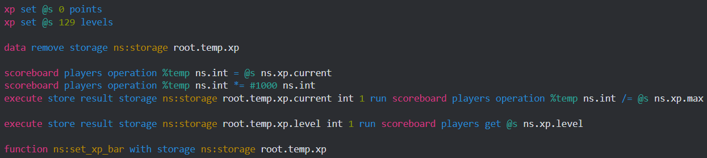
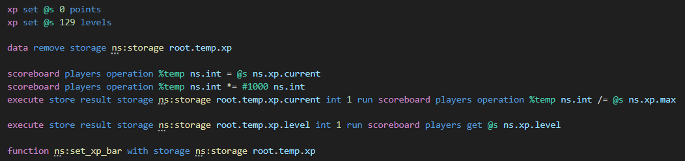
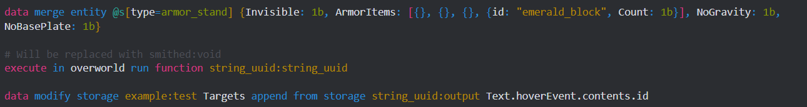
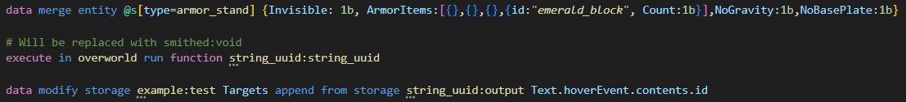

# MCF ansi highlighter

## The Highlighter compared to Syntax mcfunction
1.

2.

## Little note
It may not work 100% accurately with backslash line breaks

## Use in your projects
If you want to use the highlighter in your project, please mention link to the original github repo.
1. Downlaod `database.json` and put it in your project folder.
### Python 
2. Download `highlighter.py` and put it in your project folder.
3. From `highlighter` import class `Highlighter` in your code.
4. Use `Highlighter.highlight("<Your function here>")` to get the ansi highlighted function.
### JavaScript
2. Download `highlighter.js` and put it in your project folder.
3. From `highlighter` require calss `Highlighter` in your code.
4. Use `Highlighter.highlight("<Your function here>")` to get the ansi highlighted function.

Note: `database.json` must be at the folder where code executing. If for some reason you can't place it in that way, edit it's path in the module file.

## Other features
Highlighter has a few more functions that might be useful:
- `split("<command>")` - splits command to elements: `"execute as @e[type=pig, nbt={CustomName:'{"text":"Ruben"}'}] run say gex"` -> `["execute", "as", "@e[type=pig, nbt={CustomName:'{"text":"Ruben"}'}]", "run", "say", "gex"]`
- `target("<selector>")` highlights selector: `"@e[type=pig]"` -> `"@e[type=pig]"`
- `nbt("<tag>")` highlights nbt tag: `"{NoAI:1b}"` -> `"{NoAI: 1b}"`

## Contribution
Right now I'm only one contributor, but you feel free to contact me at discord with your ideas or developments (bth123).

